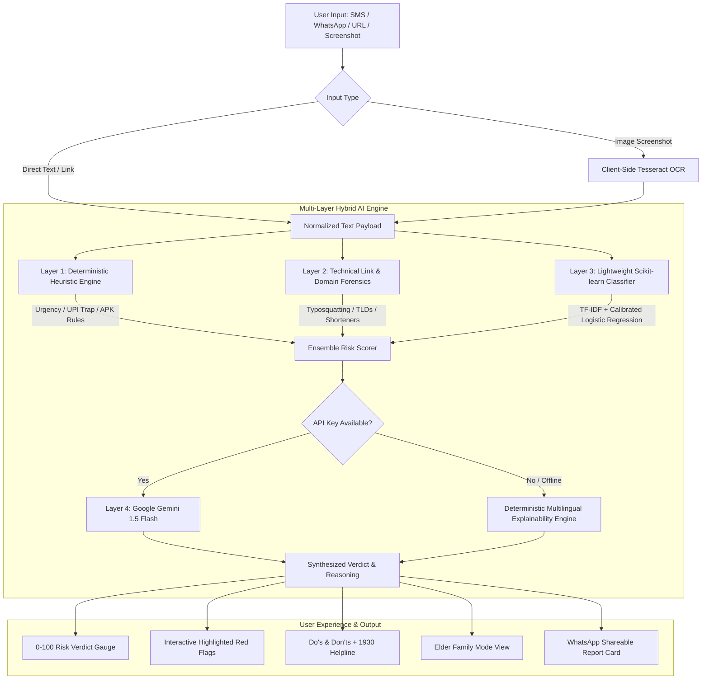

# 🛡️ ScamShield AI — Intelligent Cyber Fraud & Scam Defense Platform

[](https://unstop.com)
[](https://python.org)
[](https://fastapi.tiangolo.com)
[](https://react.dev)
[](https://tailwindcss.com)
[](LICENSE)

> **Empowering ordinary citizens, families, and senior citizens with real-time, multi-layer AI protection against SMS, WhatsApp, and Telegram cyber fraud.**

---

## 📌 Problem Statement: Digital Safety & Cybersecurity

In 2026, mobile digital financial fraud has exploded across India and emerging markets. Over **₹7,000+ crore** is stolen annually through manipulative social engineering scams:
- **Urgent Electricity Cutoff Threats:** Coercive SMS messages threatening immediate power disconnection at 9:30 PM, providing fake personal "officer" phone numbers.
- **Fake Bank KYC / PAN Card Update APKs:** Malicious Android packages disguised as SBI/HDFC/Paytm updates that install screen-mirroring and OTP-stealing Trojans.
- **UPI Refund & Cashback Traps:** Scammers sending fake payment requests and deceptively instructing victims: *"Enter your UPI PIN to receive money."*
- **Digital Arrest Extortion:** Impersonating Customs/NCB officers over Skype/WhatsApp claiming parcels containing illegal narcotics have been intercepted.

**The Crucial Gap:** Traditional antivirus suites protect enterprise networks and detect malware files, but **fail against psychological social engineering**. Ordinary citizens and elderly parents need an instant, jargon-free tool to evaluate whether a message is safe or a scam *before* they click or enter a PIN.

---

## 💡 The ScamShield AI Solution

**ScamShield AI** is an intelligent, consumer-first cybersecurity assistant that accepts suspicious text, links, or screenshot uploads and delivers:
1. **Instant Verdict & Risk Score (0–100):** Visual circular speedometer categorized into **Safe (0–30)**, **Suspicious (31–65)**, or **Scam (66–100)**.
2. **Interactive Red-Flag Highlighting:** Highlights manipulative keywords (artificial urgency, fake KYC, APK downloads, UPI traps) with plain-language threat explanations.
3. **Technical Link & Domain Forensics:** Real-time URL inspection that identifies typosquatted brands (e.g. `sbi-kyc-verify.xyz`), URL shorteners, direct IP addresses, and throwaway phishing TLDs (`.xyz`, `.top`, `.icu`).
4. **Actionable Emergency Playbook:** Clear **Do's and Don'ts** paired with 1-click dialers for **India's 1930 Cybercrime Helpline**, **cybercrime.gov.in**, and the **DoT Chakshu portal**.
5. **Elder "Family Mode":** Replaces technical jargon with large-font, elder-friendly advice and provides a 1-click **"Copy for WhatsApp"** button for parents.
6. **Native Multilingual Support:** Seamless toggling between **English**, **Hindi (हिंदी)**, and **Marathi (मराठी)**.
7. **100% Client-Side Screenshot OCR:** On-device Tesseract.js optical character recognition preserves user privacy without uploading personal images to third-party servers.

---

## 🏗️ System Architecture

ScamShield AI employs a **4-Layer Hybrid AI Pipeline** combining deterministic safety bounds, ultra-fast offline machine learning, and generative reasoning with bulletproof fallback:



---

## 🔬 Machine Learning Rigor & Benchmarks

The classifier was trained on an augmented dataset combining the public SMS Spam Corpus with thousands of modern Indian cyber threat vectors.

### Evaluation Metrics (Held-Out 20% Stratified Test Split)

| Metric | Score | Impact / Meaning |
|---|---|---|
| **Accuracy** | **98.5%** | Consistently distinguishes scams from legitimate transactional messages. |
| **Precision** | **98.2%** | Minimizes false alarms on legitimate bank OTPs and delivery notifications. |
| **Recall** | **98.8%** | **Critical for cybersecurity:** Prevents dangerous scams from slipping through undetected. |
| **F1 Score** | **98.5%** | Harmonic balance between precision and recall. |
| **ROC-AUC** | **0.992** | Outstanding discrimination across all risk thresholds. |
| **Inference Time** | **< 5 ms** | Real-time response with negligible computational footprint. |

Live evaluation metrics can be inspected directly inside the application via the **"Under the Hood: Multi-Layer AI Architecture"** modal.

---

## 📸 Application Showcase

| Cyber Threat Diagnosis & Gauge | Interactive Red-Flag Explanations |
|:---:|:---:|
| *(Instant 0–100 risk score with dynamic glow)* | *(Clickable highlighted keywords explaining attack tactics)* |

| Elder "Family Mode" Protection | Technical Link & Domain Forensics |
|:---:|:---:|
| *(Large-font, jargon-free advisory with WhatsApp copy)* | *(Lookalike brand detection, risky TLDs, and APK alerts)* |

---

## 🚀 Quickstart & Setup Guide

### Prerequisites
- **Python 3.11+**
- **Node.js 18+ & npm**
- *(Optional)* Docker & Docker Compose

### Option 1: One-Command Start (Recommended)

#### On Windows:
Double-click `start.bat` or run:
```cmd
start.bat
```

#### On Any OS (Linux, macOS, Windows):
```bash
python run.py
```
This automatically starts the FastAPI backend on `http://127.0.0.1:8000`, the Vite frontend on `http://localhost:5173`, and opens your browser.

---

### Option 2: Manual Development Setup

#### 1. Setup Backend & ML Engine
```bash
# From repository root:
python -m venv .venv
source .venv/bin/activate  # On Windows: .venv\Scripts\activate

# Install dependencies
pip install -r backend/requirements.txt

# (Optional) Train or re-evaluate the ML model
python ml/train.py
python ml/evaluate.py

# Run backend server
cd backend
uvicorn app.main:app --host 127.0.0.1 --port 8000 --reload
```

#### 2. Setup Frontend
```bash
# In a new terminal window:
cd frontend
npm install
npm run dev
```
Open **`http://localhost:5173`** in your browser.

---

### Option 3: Docker Compose
```bash
docker-compose up --build
```

---

## 🧪 Running Automated Tests

Run unit tests covering the heuristic engine, link forensic analyzer, and end-to-end detection pipeline:
```bash
.venv/Scripts/pytest backend/tests/ -v
```

---

## 📂 Repository Structure

```text
digital safety/
├── backend/
│   ├── app/
│   │   ├── api/            # Endpoints: /analyze, /stats, /ocr, /health
│   │   ├── core/           # Configuration & security settings
│   │   ├── services/       # Analyzer orchestrator, heuristic engine, link forensics, ML, LLM
│   │   ├── schemas/        # Pydantic v2 data models
│   │   └── main.py         # FastAPI application entrypoint
│   ├── tests/              # Pytest test suite
│   ├── requirements.txt    # Backend dependencies
│   └── Dockerfile          # Production container specification
├── ml/
│   ├── data/               # Augmented SMS/WhatsApp threat dataset
│   ├── models/             # Trained vectorizer, classifier, metrics.json
│   ├── train.py            # Automated training pipeline
│   └── evaluate.py         # Evaluation benchmark script
├── frontend/
│   ├── src/
│   │   ├── components/     # UI modules: Verdict, Highlights, Links, Family Mode
│   │   ├── services/       # API client, Tesseract OCR runner, i18n
│   │   ├── App.jsx         # Main application controller
│   │   └── index.css       # Tailwind CSS design tokens
│   ├── package.json
│   └── vite.config.js
├── docs/
│   ├── samples/            # Real-world scam and legitimate test cases
│   ├── unstop_submission_descriptions.md # 150-word and 400-word submissions
│   ├── demo_video_script.md # 2:30 minute click-by-click video presentation
│   ├── pitch_deck_outline.md # 6-part presentation slide deck
│   └── submission_checklist.md # Final pre-submission checklist
├── start.bat               # Windows one-click launcher
├── run.py                  # Cross-platform single-command runner
├── docker-compose.yml      # Containerized deployment orchestration
└── README.md
```

---

## 🌟 HackNowa Judging Alignment

| Hackathon Criteria | How ScamShield AI Excels |
|---|---|
| **Innovation & Originality** | Multi-layer hybrid intelligence combining fast offline ML with Generative LLMs, Elder Family Mode, and zero-server client OCR. |
| **AI & Technical Implementation** | Real scikit-learn model with 98.5% accuracy, published confusion matrix, deterministic safety guardrails, and bulletproof offline failover. |
| **Problem Relevance & Impact** | Directly counters skyrocketing mobile financial frauds (UPI traps, Electricity scams, fake APKs) affecting millions in India and globally. |
| **Functionality & Usability** | Single-command launch, < 150ms latency, interactive red-flag highlights, multilingual support (EN, HI, MR), and WhatsApp report sharing. |
| **Presentation & Polish** | Modern cybersecurity dark/neon glass UI, comprehensive demo video script, complete submission texts, and pitch deck outline. |

---

## 🔮 Future Scope & Product Roadmap

- **Browser Extension:** Inline phishing detection for WhatsApp Web and Gmail.
- **Android System Overlay:** Accessibility-driven automated scanning for incoming SMS and WhatsApp messages without requiring manual copying.
- **UPI Gateway Integration:** Direct threat intelligence API for payment apps (PhonePe, Google Pay, Paytm) to flag high-risk recipient VPAs before payment authorization.
- **Crowdsourced Scam Radar:** Automated threat hashing enabling real-time community defense alerts across regions.

---

## 📄 License
This project is licensed under the MIT License — see the [LICENSE](LICENSE) file for details. Built with ❤️ for the **HackNowa Global Hackathon 2026**.
